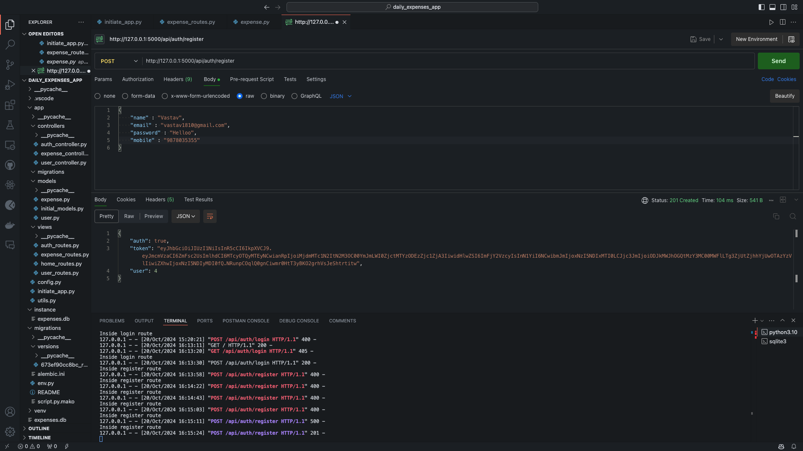
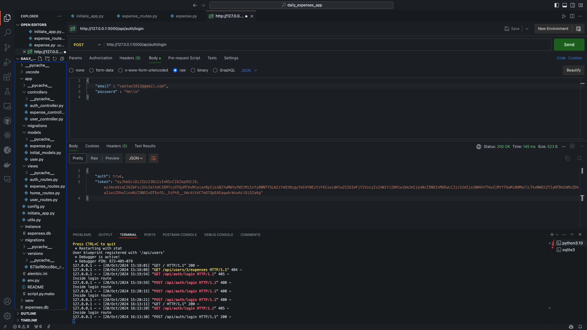
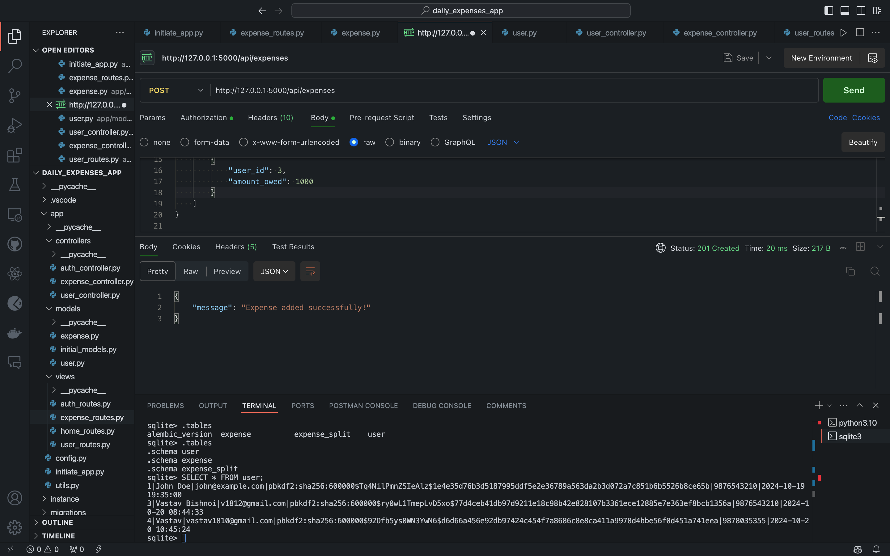
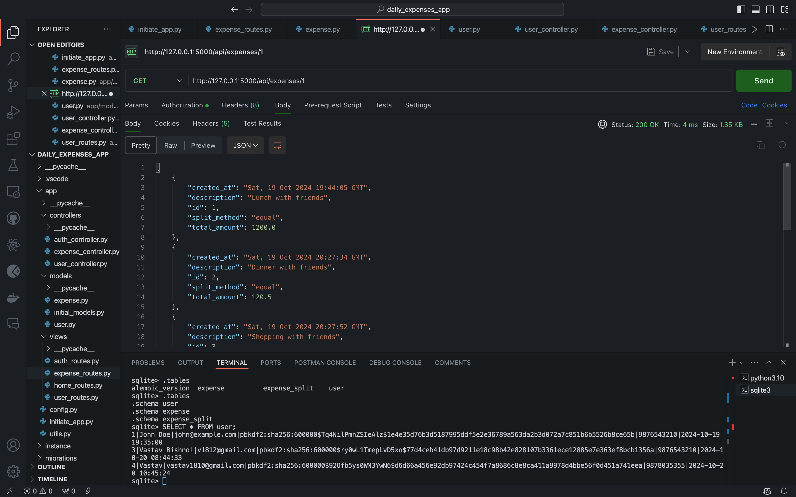
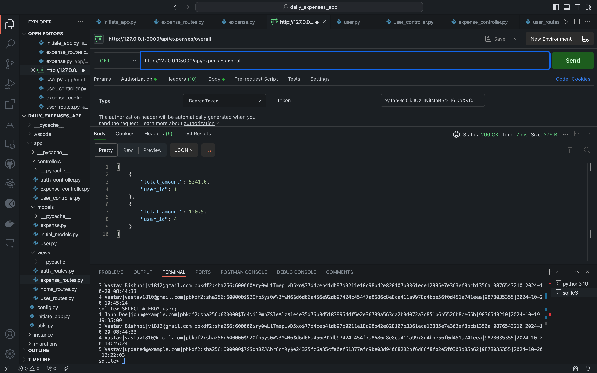
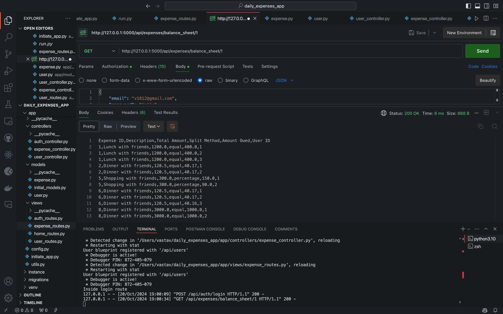
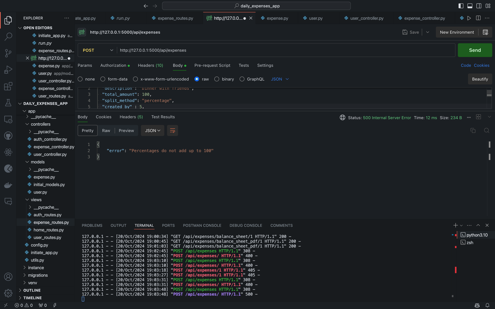
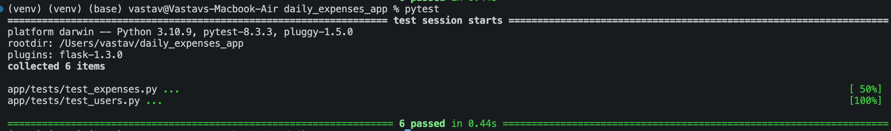

# **Daily Expenses Sharing Application**

### **Objective**

This backend application allows users to manage and share their daily expenses by splitting them based on three methods: equal, exact amounts, and percentages. The application provides user management, expense management, and features to generate downloadable balance sheets.

---

### **Features**

- **User Management**: 
  - Users can register with their name, email, password and mobile number.
  - Users can login with existing email, password.
  - Users can delete their id's.
  - Users can update their name, email, password and mobile number.
  - User authentication via JWT tokens.
  
- **Expense Management**:
  - Users can add,update,delete expenses.
  - Expenses can be split using three methods:
    - **Equal**: Split equally among all participants.
    - **Exact**: Specify the exact amount each participant owes.
    - **Percentage**: Specify the percentage each participant owes, ensuring the total equals 100%.
  
- **Balance Sheet**:
  - Show individual user expenses.
  - Show overall expenses for all users.
  - Downloadable balance sheet in CSV and PDF formats.

---

### **Technologies Used**

- **Flask**: Web framework
- **Flask-JWT-Extended**: Authentication using JWT
- **Flask-Migrate**: Database migrations
- **SQLite**: Database
- **PIP**: install from reuqirements.txt

---

### **Expense Calculation Examples**

1. **Equal Split**: 
   - Scenario: You go out with 3 friends. The total bill is 3000. Each friend owes 1000.
   
2. **Exact Split**: 
   - Scenario: You go shopping with 2 friends and pay 4299. Friend 1 owes 799, Friend 2 owes 2000, and you owe 1500.
   
3. **Percentage Split**: 
   - Scenario: You attend a party with 2 friends and one cousin. You owe 50%, Friend 1 owes 25%, and Friend 2 owes 25%.

---

## MVC Architecture

This project follows the **Model-View-Controller (MVC)** architectural pattern, which divides the application into three interconnected components. This separation helps in managing the application's complexity by segregating internal representations of information from how the information is presented and accepted.

### 1. Model
The **Model** represents the data and business logic of the application. It is responsible for handling the database and the associated queries.

- **Location**: `app/models/`
- **Files**:
  - `expense.py`: Defines the schema for the Expense entity and how the expenses are stored and retrieved.
  - `user.py`: Defines the schema for the User entity and user-related data.

### 2. View
The **View** is responsible for presenting the data to the user. Since this project is an API-based backend, the views are the API routes that return JSON data instead of rendered HTML templates.

- **Location**: `app/views/`
- **Files**:
  - `auth_routes.py`: Contains the routes for authentication, including login and registration.
  - `expense_routes.py`: Contains the routes for expense-related operations.
  - `user_routes.py`: Contains the routes for user-related operations.
  - `home_routes.py`: Contains the main application routes.

### 3. Controller
The **Controller** acts as an intermediary between the Model and View. It processes incoming requests, handles user input, interacts with the Model to retrieve or modify data, and returns the results back to the View (in this case, via JSON responses).

- **Location**: `app/controllers/`
- **Files**:
  - `auth_controller.py`: Handles logic for user authentication and authorization.
  - `expense_controller.py`: Handles logic for managing and manipulating expenses.
  - `user_controller.py`: Handles logic for managing users, updating, deleting, and fetching user-related data.

### Folder Structure
. ├── app/ │ ├── controllers/ # Controllers │ │ ├── auth_controller.py │ │ ├── expense_controller.py │ │ └── user_controller.py │ ├── models/ # Models │ │ ├── expense.py │ │ └── user.py │ ├── views/ # Views (API Routes) │ │ ├── auth_routes.py │ │ ├── expense_routes.py │ │ ├── user_routes.py │ │ └── home_routes.py │ └── ... ├── migrations/ ├── tests/ # Test cases ├── config.py ├── run.py # Entry point for running the app └── README.md


By following the **MVC** architecture, the code is organized in a way that maintains separation of concerns and improves scalability, making it easier to maintain and develop new features.

---

### **API Endpoints**

#### **User Endpoints**:
1. **Register a new user**: `POST /api/auth/register`
   - Request body: 
     ```json
     { 
       "name": "Vastav", 
       "email": "vastav1812@gmail.com", 
       "password": "password123", 
       "mobile": "9876543210" 
     }
     ```
   
2. **User login**: `POST /api/auth/login`
   - Request body: 
     ```json
     { 
       "email": "vastav1812@gmail.com", 
       "password": "password123" 
     }
     ```
   
3. **Retrieve user details**: `GET /api/users/<user_id>`

#### **Expense Endpoints**:
1. **Create expense**: `POST /api/expenses`
   - Request body: 
     ```json
     {
       "description": "Lunch",
       "total_amount": 300,
       "split_method": "equal",
       "created_by": 1,
       "splits": [
         {"user_id": 1, "amount_owed": 150},
         {"user_id": 2, "amount_owed": 150}
       ]
     }
     ```

2. **Retrieve user expenses**: `GET /api/expenses/<user_id>`

3. **Retrieve overall expenses**: `GET /api/expenses/overall`

4. **Download balance sheet**:
   - CSV: `GET /api/expenses/export/csv`
   - PDF: `GET /api/expenses/export/pdf`

5. **Update expense**: `PUT /api/expenses/<expense_id>`
   - Request body:
     ```json
     {
       "description": "Dinner",
       "total_amount": 500,
       "split_method": "exact",
       "created_by": 1,
       "splits": [
         {"user_id": 1, "amount_owed": 200},
         {"user_id": 2, "amount_owed": 300}
       ]
     }
     ```

6. **Delete expense**: `DELETE /api/expenses/<expense_id>`

---

### **Data Validation**

- Validate user inputs (name, email, mobile, etc.).
- Ensure percentages in the percentage split method add up to 100%.

---

### **Installation and Usage**

1. **Clone the repository**:
   ```bash
   git clone https://github.com/your-username/daily-expenses-app.git
   cd daily-expenses-app

### Screenshots

1. **User Registration**
   

2. **User Login**
   

3. **Expense Creation**
   

4. **User Expenses**
   

5. **Overall Expenses**
   

6. **Balance Sheet**
   

7. **Percentage Troubleshoot**
   

8. **Test Results**
   

